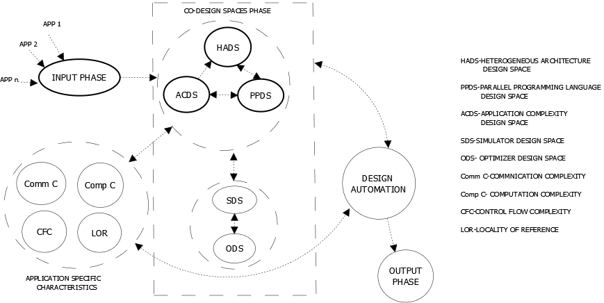
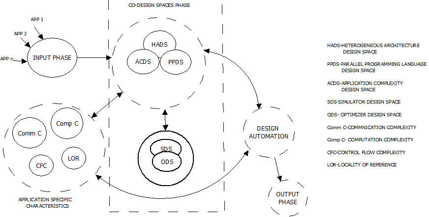
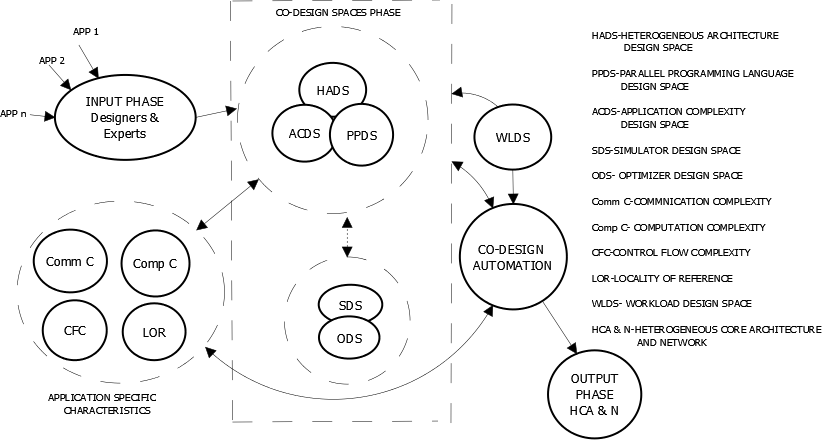

{:class="img-responsive"}
<h1>Twigraph: Discovering and Visualizing Influential Words between Twitter Profiles</h1>
<h2><a href="http://socinfo2017.oii.ox.ac.uk/" target="_blank">Social Informatics 2017</a> ,<a href="http://www.ox.ac.uk/" target="_blank">University of Oxford</a></h2>

<h3> Dhanasekar Sundararaman, Sudharshan Srinivasan </h3>
<h4>Appeared in the <b>Springer</b> Proceedings for SocInfo 2017, Oxford, UK</h4>
<i>One among the very few undergrads (probably the only one) to get a paper accepted at this conference held at Oxford. Many were into their Phd's, postdocs and some were professors.</i>
<h3><a href="https://link.springer.com/chapter/10.1007/978-3-319-67256-4_26" target="_blank">Pdf</a> &nbsp;&nbsp;&nbsp;&nbsp;&nbsp;&nbsp;<a href="https://gitlab.com/Dhanasekar-S/Twigraph" target="_blank">Code base and Results</a></h3>
<b>Abstract:</b>
The social media craze is on an ever increasing spree, and people are connected with each other like never before, but these vast connections are visually unexplored. We propose a methodology Twigraph to explore the connections between persons using their Twitter profiles. First, we propose a hybrid approach of recommending social media profiles, articles, and advertisements to a user.
The profiles are recommended based on the similarity score between the user profile, and profile under evaluation. The similarity between a set of profiles is investigated by finding the top influential words thus causing a high similarity through an Influence Term Metric for each word. Then, we group profiles of various domains such as politics, sports, and entertainment based on the similarity
score through a novel clustering algorithm. The connectivity between profiles is envisaged using word graphs that help in finding the words that connect a set of profiles and the profiles that are connected to a word. Finally, we analyze the top influential words over a set of profiles through clustering by finding the similarity of that profiles enabling to break down a Twitter profile with a lot of followers to fine level word connections using word graphs. The proposed method was implemented on datasets comprising 1.1 M Tweets obtained from Twitter. Experimental results show that the resultant influential words were highly representative of the relationship between two profiles or a set of profiles. 
 
 

<h1>Bus Tracking and Intelligent Arrival Prediction System</h1>
<h2><a href="http://dms.iitd.ac.in/IFIP-I3E_2017/homepage.html" target="_blank">The 16th IFIP Conference on e-Business, e-Services and e-Society</a> ,<a href="http://www.iitd.ac.in/" target="_blank">IIT Delhi</a></h2>

<h3>Dhanasekar Sundararaman, Gowtham R, Jagadeesh R, Sasirekha S, Joe Louis Paul I</h3>
<h4>Appeared in the <b>Springer</b> Proceedings for IFIP Conference on e-Business, e-Services and e-Society</h4>

<i> Acceptance rate < 40%. One among the very few undergrads</i>
<h3><a href="https://link.springer.com/chapter/10.1007/978-3-319-68557-1_27" target="_blank">Pdf</a> </h3>
  <b>Abstract:</b>
In this work, an efficient vehicle tracking system is designed and implemented for tracking the movement of any vehicle from any location and time. The proposed system uses popular technology that combines a smartphone application with a microcontroller that is inexpensive compared to others. The users will be able to continuously monitor a moving vehicle on demand using the Smartphone application and determine the estimated distance and time for the vehicle to arrive at a given destination. Apart from this, the system is designed further to account for the case of failing to catch one’s vehicle by dynamically suggesting a new vehicle within one’s reach with an estimated time and a route. The data collected is effectively used to predict the estimated arrival time of the vehicles using sophisticated machine learning technique Artificial Neural Networks (ANN). While there are other systems on vehicle tracking, we present a vehicle tracking, dynamic route suggestion on failing to catch one’s vehicle and intelligent arrival time prediction system together making it a comprehensive system for users. The feasibility and effectiveness of the system are presented through experimental results of the vehicle tracking system and some experiences on practical implementations. 
 
 

<h1>An analysis of nonimmigrant work visas in the USA using Machine Learning</h1>

<h2>International Conference on Compute and Data Analysis</h2>

<h3>Dhanasekar Sundararaman, Nabarun Pal, Aashish Kumar Misraa</h3>

<h3><a href="https://Dhanasekar-S.github.io/research/3paper.pdf" target="_blank">Pdf</a>  &nbsp;&nbsp;&nbsp;&nbsp;&nbsp;&nbsp;<a href="https://gitlab.com/Dhanasekar-S/visa_analysis" target="_blank">Code base and Results</a></h3>
<b>Abstract:</b>
High-skilled immigrants are a very important factor in US innovation and entrepreneurship, accounting for roughly a quarter of US workers in fields such as computer science and delivering in terms of patents or firm starts. Their contributions to the US is rapidly increasing in the past three decades and are found to be well trained and skilled on average than their native counterparts. While the impact of these high-skilled workers is signified, the way in which they compete to enter a tech hub like the US is rather not fair. H-1B, the work visa to import high-skilled workers, is not used for high skilled anymore but rather used to import cheap labor to displace native workers in many cases. Many billionaires, experts, pundits and even the government are looking for many amendments in H-1B to abolish this by bringing in a merit system or increasing the minimum wages to awarding these visas. We attempt to analyze the petitions filed from 2011-16 and classify the petitions filed as positive or negative, indicating whether the petition is highly skilled or not. After classifying, we build a model using Random forests to predict any visa petition in any state of US as positive or negative. Experimental results show the top companies that are classified as abusing these visas are well consistent with the ones shown in reports and news articles.
 
 

<h1>TweetIT- Analyzing Topics for Twitter Users to garner Maximum Attention</h1>

<h2>International Conference on Machine Learning and Soft Computing, Vietnam</h2>

<h3>Dhanasekar Sundararaman, Priya Arora, Vishwanath Seshagiri</h3>
<h4>To appear in the <b>ACM</b> Proceedings of the 2018 International Conference on Machine Learning and Soft Computing</h4>
<h3><a href="https://dl.acm.org/citation.cfm?id=3184093" target="_blank">Pdf</a>  &nbsp;&nbsp;&nbsp;&nbsp;&nbsp;&nbsp;<a href="https://gitlab.com/thebrahminator/Twitter-Topic-Detection" target="_blank">Code base and Results</a></h3>
<b>Abstract:</b> 
Twitter, a microblogging service, is today’s most popular platform for communication in the form of short text messages, called
Tweets. Users use Twitter to publish their content either for expressing concerns on information news or views on daily conversations. When this expression emerges, they are experienced by the worldwide distribution network of users and not only by the interlocutor(s). Depending upon the impact of the tweet in the form of the likes, retweets and percentage of followers increases for the user considering a window of time frame, we compute attention factor for each tweet for the selected user profiles. This factor is used to select the top 1000 Tweets, from each user profile, to form a document. Topic modelling is then applied to this document to determine the intent of the user behind the Tweets. After topics are modeled, the similarity is determined between the BBC news dataset containing the modeled topic, and the user document under evaluation. Finally, we determine the top words for a user which would enable us to find the topics which garnered attention and has been posted recently. The experiment is performed using more than 1.1M Tweets from around 500 Twitter profiles spanning Politics,Entertainment, Sports etc. and hundreds of BBC news articles. The results show that our analysis is efficient enough to enable us to find the topics which would act as a suggestion for users to get higher popularity rating for the user in the future.
 
 

<h1>YouTree- A Visualization Paradigm of Statistically and Textually Similar Videos.</h1>

<h2>International Conference on Intelligent Computing and Applications, Australia</h2>

<h3>Dhanasekar Sundararaman, Vishwanath Seshagiri, Balaji Ramesh, Priya Arora</h3>
<h4>To appear in the <b>ACM</b> Proceedings of 7th International Conference on Intelligent Computing and Applications</h4>
<h3><a href="https://dl.acm.org/citation.cfm?id=3177467" target="_blank">Pdf</a>  &nbsp;&nbsp;&nbsp;&nbsp;&nbsp;&nbsp;<a href="https://gitlab.com/thebrahminator/Youtube-View-Predictor" target="_blank">Code base and Results</a></h3>
<b>Abstract:</b> 
The rise of social media usage in the form of multimedia is on an exponential increase lately owing to the increased internet bandwidths in the recent past. As a result, people communicate in the form of videos and images a lot more than ever. One such video sharing and content developer platform is Youtube. Youtube have many features on video analytics in the form of recommendation systems, monetization etc. It also offers many features for developers to evaluate their content and offer insights on the performance of their videos. Though these features are available, there is not a feature for developers to evaluate their content based on the performance of other’s videos, which share the same nature of content, the similarity between any two videos. Here, the similarity between two videos has a statistical measure apart from the content, which includes the description and comments of a video. Thus, we propose statistical and textual similarity analysis between a query video and a range of videos to determine the most similar videos both textually and statistically. The statistical similarity is evident from the number of derived features extracted from a video and the textual similarity is found by analyzing the text data from the description and comments of a video. Experimental results show that, the resultant similar videos are highly representative of both the statistical and textual similarity and can be used as a measure to compare two videos.
 
 

<h2>Research work at <a href="http://www.warftindia.org/joomla/index.php?option=com_content&view=article&id=144&Itemid=108">WAran Research FoundaTion</a></h2>
My work was primarily focused on developing a co-design automation framework for the formation of application specific heterogeneous architecture through techniques of Machine learning. I was also responsible for the design of customizable workloads of user specified complexities and Application Cloning. This involves the analysis of parallel program applications for its various complexities to facilitate the architecture design.

Research Papers for IEEE Transactions on Computers(Not submitted):
<h1>"High Performance Computing Co-Design Space I : Application Complexity Design space, Architectural Design Space and Parallel Programming Design Space"</h1>

<h3>Anirudh Seshadri, Dhanasekar Sundararaman, Sudharshan Srinivasan</h3>

<h3><a href="https://Dhanasekar-S.github.io/research/warft1.pdf" target="_blank">Pdf</a></h3>

{:class="img-responsive"}

It deals with the design of Heterogeneous Many-Core Processors with an emphasis on the impact of Co-Design for achieving low power, higher performance and much better resource utilization. With the need for higher performances computing system ever increasing, it is indispensable for the architectures to be highly scalable. This scalability is achieved by employing a parallel programming language design space with built in parallel constructs pertaining to an application enabling greater scaling. While most of the current day research focuses on binding the architecture with the target application, the impact of programming languages has not been considered. The binding across the application characteristics ,namely the computational structures and communication pattern(extracted from the application complexity design space) and the target many-core architecture(the corresponding functional units, algorithm level functional units and the scalars that get fixed in the many-core architecture space ). This in turn triggers the parallel programming design space to frame the respective parallel constructs while the core types are fixed by the application specific functional units. Another important feature of the architecture proposed is its ability to run Simultaneous Execution Of Multiple Applications without Space-Time Sharing. This enables the functional units to have instructions of the same type from several applications in its pipelines stages simultaneously thereby utilizing the resources to its fullest. Thus a Co-design involving the Application, Architecture and the Parallel Programming Language is established. Though many papers suggest a co-design between the application and the architecture, most of them focus on the computation complexities of the application and tend to ignore the performance and power gain that may be achieved by analyzing the communication complexities. A model is proposed which analyses both the computation and communication aspects of the application which aids in better design of the Heterogeneous cores. Such an analysis on the communication complexities enables us to tailor make the cores for applications and thereby reducing the Inter-Core Communication and attempts at maximizing the Intra-Core communication.
 
 

<h1>"High Performance Computing Co-Design Space II: Design Automation and Customizable Workload"</h1>

<h3>Dhanasekar Sundararaman, Sudharshan Srinivasan, Anirudh Seshadri</h3>

<h3><a href="https://Dhanasekar-S.github.io/research/warft2.pdf" target="_blank">Pdf</a></h3>

{:class="img-responsive"}

Co-design is a complex task in which application complexity design space, architecture design space, parallel language design space, simulator design space, optimizer design space(collectively called many-core co-design spaces) gets integrated through a binding process. Design and development of large scale many-core architecture using the many-core co-design spaces will be highly time consuming and it is indispensable to build a co-design automation process. The co-design automation is frame worked to comprehend the dependencies across the many-core co-design spaces and devise the logics behind these interdependencies using a set of algorithms. The software modules of these algorithms and the rest from the many-core co-design spaces interact to crop up the power-performance optimized many-core architecture. It is imperative that such many-core co-design spaces powered by an automation process have built in user customizable workload generation mechanism. The emergent many-core architecture should be subjected to benchmarking for performance, cache hierarchy, network or the scheduler comprehensively. Customizability benefits generation of complex workloads with desired computation complexity, communication complexity, control flow complexity and locality of reference under a specified distribution based on quantitative models. Because of these attributes sudden variations called computational and communication surges can be generated to bench mark deeper architectural issues like network stability. A deeper analysis of the processes involved in selecting the current benchmark workloads reveal that their lifespan is limited to a time window during which the technology driven heterogeneous many core architecture complexities vary very rapidly and with lot more challenging applications coming on. The most fundamental reason for this is that workloads need to be built on quantitative modeling of computational complexity, communicational complexity, control flow complexity and locality of reference. Further to this quantification of the workload characteristics , customizability is an another important factor to be considered such that scaling up this workload characteristics along technology time frame will be possible. None of the current day benchmark suites encompasses applications that can match the attributes of workload customizability presented in this paper.
 
 

<h1>"High Performance Computing Co-Design Space IIl : Simulation Design Space and Optimization Design Space"</h1>

<h3>Sudharshan Srinivasan, Anirudh Seshadri, Dhanasekar Sundararaman</h3>

<h3><a href="https://Dhanasekar-S.github.io/research/warft3.pdf" target="_blank">Pdf</a></h3>

{:class="img-responsive"}

Simultaneous execution of multiple applications without space time sharing (instructions of same type but from different applications can get simultaneously pipelined within the same functional units) unlike multi-programming, augments the resource utilization to a large extent unlike the conventional systems. In such an environment, main memory bank allocation and the cache levels need to be aware of the dynamics of multiple applications execution to achieve memory system efficiency. Most importantly under the co-design methodology in which the application complexity design space, architecture design space and parallel language design space gets integrated through a binding process. Further the mechanism of many-core co-design spaces is bound to crop up different ISAs, tightly coupled to the attributes of multiple applications and the target many-core architecture. None of the current simulators like Graphite, Sniper and Gems etc. are competent enough to get merged with the concept of many-core co-design spaces. In this paper such a simulator is proposed and is driven by an analytical time model. Design-time power-performance optimization of many-core architectures essentially need to take care of simultaneous execution of multiple applications and not just a single application unlike the current optimizers. Optimization of many-core architectures meant for simultaneous execution of multiple applications without space time sharing needs to be entrenched totally on different approach which is independent of Op-Techniques. Here the optimization heuristics are committed to the attributes of the multiple applications. In the first phase of optimization, the huge initial count of functional units (multiple applications specific functional units and scalars), obtained from the many-core co-design spaces , through the complex process of co-design automation, gets power-performance optimized. In the second phase of optimization the types of cores get optimized. In the third phase the overall count of all the cores gets optimized. Optimization presented here is itself an integral part of the co-design automation. This paper also introduces such an optimizer integrated with the proposed simulator.
 
 

<h1>YouWeLike: Determining the popularity of online multimedia using engagement metrics.</h1>

<h2>2017 IEEE MIT UNDERGRADUATE RESEARCH TECHNOLOGY CONFERENCE</h2>

Social Media usage is exponentially increasing, and people are connected with each other like never before. One such media is the video sharing platform Youtube, which does the job of spreading contents to people instantly in the form of videos. Apart from delivering quality content, it also encourages creators to make original content and reward them through monetization. The popularity of videos in such a video sharing platform is determined by some factors ranging from the substance of that video, target audience, retentivity to the popularity of that channel. We develop a model YouWeLike that predicts the popularity of a video in the form of the number of likes given some features that include direct indicators like number of views, number of dislikes, number of comments, time published, video length and unnoticed sophisticated features that often determines the popularity of any video. These advanced features include video impact factor which determines the impact of that video alone irrespective of the popularity of that channel, channel strength which determines the performance of a channel by analysing the number of views and subscribers, video positivity and so on. We derive many such intricate features and develop a model that incorporates such features to determine the number of likes for a video. We extracted 11 different features for 1.1M such videos and trained a Random Forest model to predict the number of likes. The model consists of 500 Decision Trees, and all the features are used as inputs. Experimental results show that the prediction accuracy for some likes was much higher for the model with the derived features we mentioned than the one with the right features alone. It proves that there is an underlying unexplored pattern that determines the popularity of a video. The model performed well with a training accuracy of 99.1% and a test accuracy of 96.4% and efficiently predicted the number of likes for a video.
 
 
<h1>Ultrasonic Indoor Profiling</h1>
Indoor profiling, a process of sketching the outline of an environment, is widely used in strategic planning for military operations and in times of disaster for evacuation. Most of the current work deals with capturing images of the hostile environment using multimedia devices. This, however, requires relatively high data transmission due to the detail of information being conveyed.We aim to achieve a reduction in the data transmitted by employing ultrasonic sound sensors to construct the image using simple distance vectors. The lag between the emitted ultrasonic wave and the reflected wave gives us an insight into the depth of the obstacle. A moving agent is sent in whose initial coordinates are known to us. At regular intervals, the depth data are measured and the profile of the environment is generated with respect to the initial coordinates. A higher resolution image may be obtained by collecting more number of samples. We use the basic concepts of trigonometry and projections to collect samples at various levels. The processing of data is done at the backend which enables us to have a simpler front end device responsible for collecting the distance information. The system proves extremely valuable with the assumption that an agent, capable of maneuvering across any flat surface (This assumption is needed due to the lag of time), carries the front-end setup. The data collected by the sensors are transmitted to the back end using a wireless transmitter. The open source software GNUPLOT is used to generate profile image. The data collected thus far is analyzed for different obstacles and can be treated as a classification problem. Several obstacles of different shapes are labeled and the characteristic of the data is analyzed to match it with the labeled obstacle through classification.
 
 

<h1>Intelligent Response System and a Personal Assistant</h1>
With the advancements in Artificial Intelligence, almost every industry/organization is moving towards automation of tasks that are performed by humans now. One such instance is the use of automated chat bots cum personal assistant that takes care of all the requests of their customers. These programs can handle requests throughout the day without any time considerations unlike humans and is a one-time cost affair. There are chat bots that are created specifically for a domain like health or entertainment, but it lacks to respond to a generalized discussion, while the generic chat bots are limited to the amount of knowledge imbibed in it in the form of data sets. With a large number of conversational data available online in the form of social media in websites like Facebook and Twitter, it is worthwhile to take these data as a possible reply to a user’s query as these data are continuously updated based on the news updated throughout the world. These replies are analyzed, processed and ranked based on the query given by the user to retrieve the most appropriate reply to a user’s query. The other theme of this paper is the use of Personal Assistant features to automate primitive operations in a smartphone such as sending texts, emails and setting an alarm through a command based approach. The experimental results show that with the help of a powerful machine learning algorithm for ranking the most suitable response to a user’s request, the efficiency of choosing the best response is considerably increased.
 
 
